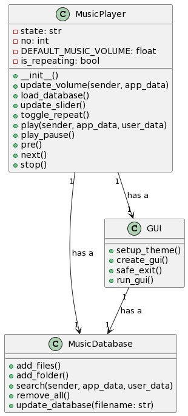

<h2 align="center">El - Sambo Musicart</h2>

<b>El- Sambo Musicart adalah program untuk music player sederhana</b>

<kbd></kbd>

## Tentang Program
- **El - Sambo Musicart adalah program music player, dibuat menggunakan bahasa pemrograman python. Pembuatan program ini juga didukung oleh beberapa modul.**

## UML DIAGRAM
- Class Diagram
- 
- **Activity Diagram**
- 
- **Use Case Digram**
- **Sequence Diagram**

## Cara penginstalan
- **Download Zip file dari repository, kemudian extract**
- **Pada terminal, ketik `pip install -r requirements.txt`**
- **Run file FIX.py**

## Cara penggunaan
- **Pilih Add Folder/Add File, nanti akan diarahkan ke directory device**
- **Pilih Folder/File, yang ingin digunakan**
- **Pilih audio yang ingin digunakan**
- **Enjoy!**

## Cara penggunaan
- **Add Folder untuk menampilkan seluruh music dari folder**
- **Add File untuk menampilkan music berdasarkan file**

## Thank you
> **Terimakasih sudah berkunjung, semoga bisa bermanfaat**
